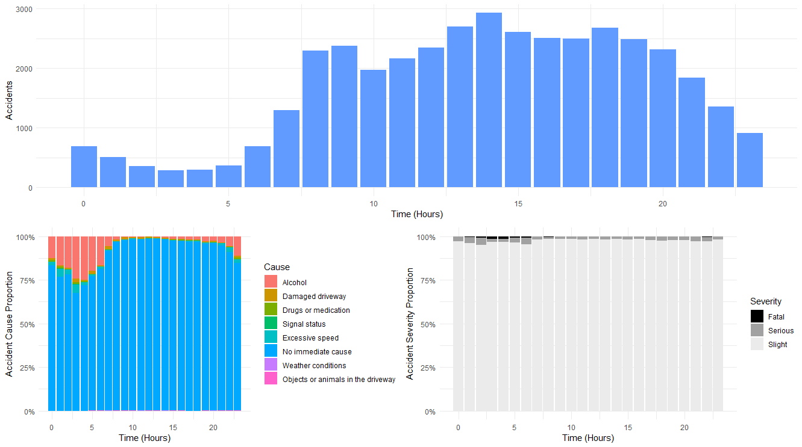
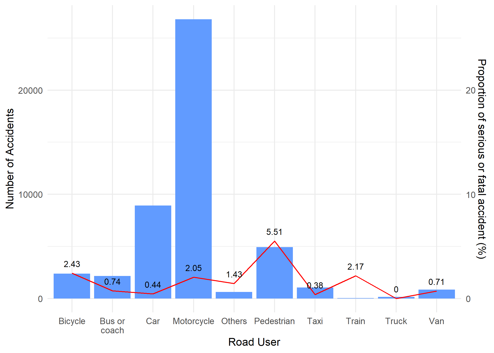
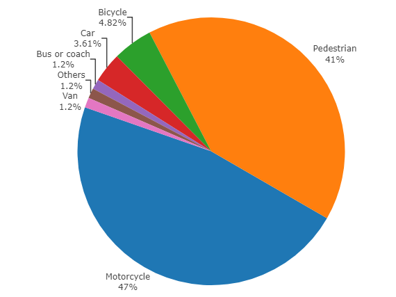
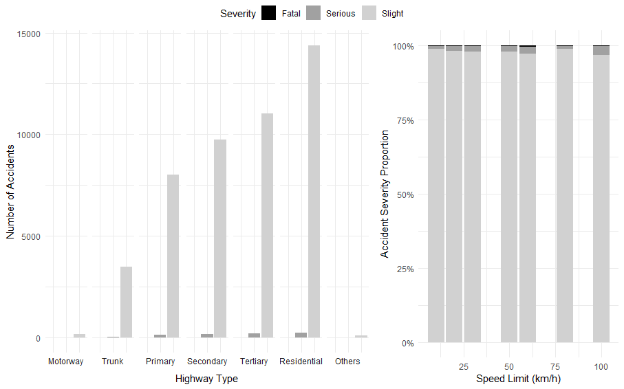

```{r setup, include=FALSE}
knitr::opts_chunk$set(echo = FALSE, warning = FALSE, message = FALSE, eval = TRUE, fig.align="center")
```

# Introduction

During the last decades, the number of studies using geographical data has increased exponentially; this is because of the wide range of benefits that geographic data has as well as the higher power of the computers. The main benefit of this data type is that it can be applied to different fields such as deciding where a hospital should be built, identifying which roads are dangerous or where retails would have more customers.

The purpose of this study is to research the main accident causes in Barcelona from the last 4 years (2016-2019). We will identify how different features of accidents, such as the car type or the cause, affect their severity. In addition, we analyse how night clubs increase the number of accidents due to alcohol during the opening time. Finally, we introduce a model whose purpose is to predict the accident severity and help local authorities to analyse the situation persons involved beforehand.

# Libraries

The project involves several libraries with different purposes; however, most of them are related to the plot of our findings in the best graphical way. For this purpose, we use *ggplot2*, *leaflet* and *plotly*, in general, we use ggplot2 but when we prefer leaflet for showing a complex map (a heatmap, for example) and plotly for pie charts.

On the other hand, the previous work of collecting, cleaning, and handling data is made by other powerful libraries such as *osmdata*, *stringi*, *lubridate*, *sf*, *sp* and *tidyverse*. Osmdata and other base R functions are used to collect the data needed from different servers while the other libraries are for cleaning as well as handling tasks. Finally, we use the gradient boosting library *XGBoost* for modeling the data via machine learning. 

For the reproducible code and the remaining libraries, see Rmd file.

```{r}
library(knitr)
library(pct)
library(sf)
library(stplanr)
library(tidyverse)
library(osmdata)
library(tmap)
library(leaflet)
library(KernSmooth)
library(sp)
library(reshape2)
library(plotly)
library(rgeos)
library(ggpubr)
library(lubridate)
library(stringi)
library(mapview)
library(xgboost)
```

# Data

## Data Collection

We use data from two providers, Barcelona City Council and OpenStreetMap (Ajuntament de Barcelona, 2020). All accident and night club’s data are provided by the Barcelona council and other information, such as road type or speed limits are collected via OpenStreetMap.

The council provides all data sets, in csv format, individually what means that each year has its owns the file. Furthermore, the accident data is divided into five sets: general information, type, cause, persons, and vehicles involved. Therefore, to automate this tedious procedure, we create the following function to which we must indicate which server resource we want to access and the name with which to save it.

```{r echo = TRUE, eval = FALSE}
download_resouce = function(source_id, resource_id, file_name_save, file_name = "_") {
  source_url = "https://opendata-ajuntament.barcelona.cat/data/dataset"
  download.file(
    paste(source_url, source_id, "resource", resource_id, "download", file_name, sep="/"), 
    paste("datasets", file_name_save, sep = "\\")
  )
}
```

On the other hand, the collection from the roads features is easily performed by the following code and then it is saved to a Rds file.

```{r echo = TRUE, eval = FALSE}
roads_osm = opq("Barcelona ES") %>% 
  add_osm_feature(key = "highway") %>%
  osmdata_sf()
```


```{r eval = !file.exists("datasets/roads_osm.Rds")}
# Create folder
dir.create(file.path(getwd(), "datasets"), showWarnings = FALSE)
dir.create(file.path(getwd(), "saves"), showWarnings = FALSE)

# Roads in Barcelona with features
roads_osm = opq("Barcelona ES") %>% 
  add_osm_feature(key = "highway") %>%
  osmdata_sf()

roads_osm$osm_points$name = iconv(roads_osm$osm_points$name, from = 'UTF-8', to = 'UTF-8')
roads_osm$osm_lines$name = iconv(roads_osm$osm_lines$name, from = 'UTF-8', to = 'UTF-8')
roads_osm$osm_polygons$name = iconv(roads_osm$osm_polygons$name, from = 'UTF-8', to = 'UTF-8')
roads_osm$osm_multipolygons$name = iconv(roads_osm$osm_multipolygons$name, from = 'UTF-8', to = 'UTF-8')
saveRDS(roads_osm, "datasets\\roads_osm.Rds")

# Attractions of Barcelona
#attractions_osm = opq("Barcelona ES") %>% 
#  add_osm_feature(key = "tourism", value = "attraction") %>%
#  osmdata_sf()
#saveRDS(attractions_osm, "datasets\\attractions_osm.Rds")

# Download function for Barcelona official datasets
download_resouce = function(source_id, resource_id, file_name_save, file_name = "_") {
  source_url = "https://opendata-ajuntament.barcelona.cat/data/dataset"
  download.file(
    paste(source_url, source_id, "resource", resource_id, "download", file_name, sep = "/"), 
    paste("datasets", file_name_save, sep = "\\")
  )
}

# Official names of streets and roads in Barcelona with Spanish National Institute of Statistics (INE) and municipal codes.
#source_id = "d7802fd1-cdfb-4562-9148-d18722d7e2d8"
#download_resouce(source_id, "2b010e59-6952-4b27-9c4e-47fcaf64c916", file_name_save = "street_names.csv")

# List of music and drinks venues in the city of Barcelona
source_id = "4b121b7e-c956-4fb0-bfd7-0ebc617e6643"
download_resouce(source_id, "55fa8243-c4f5-4b0d-9fa1-a731a651166e", file_name_save = "night_places.csv")

# Accidents by General
source_id = "e769eb9d-d778-4cd7-9e3a-5858bba49b20"
download_resouce(source_id, "be253540-d3ec-418f-9b72-386492fa5269", file_name = "2016_accidents_gu_bcn_.csv", file_name_save = "accidents_2016.csv")
download_resouce(source_id, "acc9db4c-17b2-4862-8bcc-ed216f8e5839", file_name = "2017_accidents_gu_bcn_.csv", file_name_save = "accidents_2017.csv")
download_resouce(source_id, "f94d9ac3-e46e-47cd-a3d0-a9b5b9639d86", file_name = "2018_accidents_gu_bcn_.csv", file_name_save = "accidents_2018.csv")
download_resouce(source_id, "7a376881-0767-4ec2-bb41-12f4b645f1df", file_name = "2019_accidents_gu_bcn_.csv", file_name_save = "accidents_2019.csv")

# Accidents by Persons Involved
source_id = "87aa433e-fef8-4ff4-8f9a-d66e9beefff6"
download_resouce(source_id, "08afa8b9-c2fd-4a11-a416-e8650b7fb838", file_name = "2016_accidents_persons_gu_bcn_.csv", file_name_save = "accidents_persons_2016.csv")
download_resouce(source_id, "435d38f9-0b15-4bd0-b32e-e187965de8db", file_name = "2017_accidents_persons_gu_bcn_.csv", file_name_save = "accidents_persons_2017.csv")
download_resouce(source_id, "c6b05180-8084-4d89-a80c-f56de1f8e4de", file_name = "2018_accidents_persons_gu_bcn_.csv", file_name_save = "accidents_persons_2018.csv")
download_resouce(source_id, "172025e0-8348-4376-9266-550a9b227ea4", file_name = "2019_accidents_persons_gu_bcn_.csv", file_name_save = "accidents_persons_2019.csv")

# Accidents by Causality
source_id = "719b1054-4166-4692-b63e-622b621b4293"
download_resouce(source_id, "1c647e80-fbdf-4f87-af48-3085fcc9a4a5", file_name = "2016_accidents_causes_gu_bcn_.csv", file_name_save = "accidents_causality_2016.csv")
download_resouce(source_id, "adc0c6e9-4af6-41c0-9020-5af7a28f5461", file_name = "2017_accidents_causes_gu_bcn_.csv", file_name_save = "accidents_causality_2017.csv")
download_resouce(source_id, "200fa1e2-7188-4a01-9b3d-e4ac0016528e", file_name = "2018_accidents_causes_gu_bcn_.csv", file_name_save = "accidents_causality_2018.csv")
download_resouce(source_id, "e9946c60-64e8-44c4-bce5-5de78adbe190", file_name = "2019_accidents_causes_gu_bcn_.csv", file_name_save = "accidents_causality_2019.csv")

# Accidents by Type
source_id = "834b8920-0685-4e16-8e20-faf13645f4f3"
download_resouce(source_id, "e7e97824-24a8-4771-b320-edf8ba3ea3e3", file_name = "2016_accidents_tipus_gu_bcn_.csv", file_name_save = "accidents_type_2016.csv")
download_resouce(source_id, "bc2cb941-695c-4fe3-87ba-2ce931df57ff", file_name = "2017_accidents_tipus_gu_bcn_.csv", file_name_save = "accidents_type_2017.csv")
download_resouce(source_id, "1f43e605-4ace-4134-a18b-5a329bf9000c", file_name = "2018_accidents_tipus_gu_bcn_.csv", file_name_save = "accidents_type_2018.csv")
download_resouce(source_id, "4bf617c6-7fe0-4e6a-b010-1c6fef544a31", file_name = "2019_accidents_tipus_gu_bcn_.csv", file_name_save = "accidents_type_2019.csv")

# Accidents by Vehicle
source_id = "317e3743-fb79-4d2f-a128-5f12d2c9a55a"
download_resouce(source_id, "b49e7402-65ed-49c8-8d03-a6cade73bad6", file_name = "2016_accidents_vehicles_gu_bcn_.csv", file_name_save = "accidents_vehicles_2016.csv")
download_resouce(source_id, "51ae5fea-dfc4-4da3-9421-8ed21a9cfdeb", file_name = "2017_accidents_vehicles_gu_bcn_.csv", file_name_save = "accidents_vehicles_2017.csv")
download_resouce(source_id, "6e2daeb5-e359-43ad-b0b5-7fdf438c8d6f", file_name = "2018_accidents_vehicles_gu_bcn_.csv", file_name_save = "accidents_vehicles_2018.csv")
download_resouce(source_id, "f773b7eb-0e2f-467a-86c8-b90e9fd7d29a", file_name = "2019_accidents_vehicles_gu_bcn_.csv", file_name_save = "accidents_vehicles_2019.csv")

```

## Data Cleaning and Preparation

In this section, we read, clean, merge, and transform the datasets obtained in the Data Collection to the desired format.

Firstly, for reading, we read the downloaded files using the function **read.csv** and setting the encoding to “UTF-8” as the original file contains special characters. Before merging each batch of accident files using **rbind**; we fix some wrong numeric values which have “,” for decimals and not “.” (as it is used in other variables) and then fix the coordinates which had this error. As this problem is generally repeated in all datasets, we create the following function and call it every time that we read an accident data file:

```{r echo = TRUE, eval = FALSE}
fix_dataset = function(dataframe) {
  dataframe = dataframe %>% mutate(
    coordinate_utm_x = as.numeric(as.character(sub(",", ".", coordinate_utm_x, fixed = T))), 
    coordinate_utm_y = as.numeric(as.character(sub(",", ".", coordinate_utm_y, fixed = T))),
    longitude = as.numeric(as.character(sub(",", ".", longitude, fixed = TRUE))), 
    latitude = as.numeric(as.character(sub(",", ".", latitude, fixed = TRUE))),
    longitude = ifelse(longitude > 3, longitude / 1000, longitude),
    latitude = ifelse(latitude > 42, latitude / 1000, latitude))
  return(dataframe)
}
```

Finally, we translate the values, which are later shown at graphs, from Catalan to English using the function **revalue** (*plyr* package).

On the other hand, the road features data do not share any variable with the accident data at 100%, only the name of the street would partially match because the OSM data is unofficial. Therefore, there is no simple way to merge both sets and we will use the street name along with the geographical data (latitude and longitude) to create a table of relationships between them. To do so, we remove special characters and lowercase from the street names of both sets and calculate the distance from the accident location to all roads containing the name of the road. Then, we select the one with the shortest distance. In the following iteration, before repeating the process we check if the location has already been searched and if so, we avoid calculating the distances again. 

Doing this procedure, we avoid using simple brute force and consequently, reduce the time consumption from roughly 0.18 seconds iteration (computing distance with all roads) to 0.06-second iteration. This improvement reduces the total time consumption from approximately 2 hours and 23minutes to only 48 minutes (see code in the Rmd file).

```{r}
roads_osm = readRDS("datasets\\roads_osm.Rds")
roads_osm$osm_points = roads_osm$osm_points %>% filter(!is.na(name))
roads_osm$osm_lines = roads_osm$osm_lines %>% filter(!is.na(name))
roads_osm$osm_polygons = roads_osm$osm_polygons %>% filter(!is.na(name))
roads_osm = osm_poly2line(roads_osm)
roads_osm = roads_osm$osm_lines %>% 
  select(osm_id, name, bicycle, foot, highway, lanes, maxspeed, oneway, surface) %>%
  filter(!is.na(maxspeed)) %>% 
  mutate(
    maxspeed = as.numeric(as.character(maxspeed)),
    highway = plyr::revalue(highway, c(
   "cycleway"="Cycleway", "living_street"="Residential", "motorway"="Motorway","motorway_link"="Motorway",
   "pedestrian"="Residential", "primary"="Primary", "primary_link"="Primary", "residential"="Residential",
   "secondary"="Secondary", "secondary_link"="Secondary", "service"="Others", "tertiary"="Tertiary", "tertiary_link"="Tertiary",
   "track"="Others", "trunk"="Trunk", "trunk_link"="Trunk", "unclassified"="Others")),
    highway = factor(highway, levels = c("Motorway", "Trunk", "Primary", "Secondary", "Tertiary", "Residential", "Others"))
 )

# Reading Official data with correct names, cleaning/fixing some data, translating some values which will be used later, etc.

col_names = c("facility_id", "facility", "section", "street_type", "street_name", "street_number_1", "street_number_2", "neighbourhood_id", "neighbourhood_name", "distric_id", "district_name", "postcode", "city_id", "city", "latitude", "longitude", "x_etrs89", "y_etrs89", "x_ed50", "y_ed50", "phone_number", "phone_type", "phone_info", "period_initial", "period_end", "open_days", "time_opening", "time_closing", "time_observations", "x")
night_places = read.csv("datasets\\night_places.csv", encoding="UTF-8", col.names = col_names)

fix_dataset = function(dataframe) {
  dataframe = dataframe %>% mutate(
      coordinate_utm_x = as.numeric(as.character(sub(",", ".", coordinate_utm_x, fixed = TRUE))), 
      coordinate_utm_y = as.numeric(as.character(sub(",", ".", coordinate_utm_y, fixed = TRUE))),
      longitude = as.numeric(as.character(sub(",", ".", longitude, fixed = TRUE))), 
      latitude = as.numeric(as.character(sub(",", ".", latitude, fixed = TRUE))),
      longitude = ifelse(longitude > 3, longitude / 1000, longitude),
      latitude = ifelse(latitude > 42, latitude / 1000, latitude))
  return(dataframe)
}

col_names = c("record_id", "distric_id", "district_name", "neighbourhood_id", "neighbourhood_name", "street_id", "street_name", "postcode", "week_day", "week_day_abb", "day_type", "year", "month", "month_name", "day", "time", "time_of_day",  "pedestrian_cause", "num_deaths", "num_slight", "num_serious", "num_persons", "num_vehicles", "coordinate_utm_x", "coordinate_utm_y", "longitude", "latitude")
a = read.csv("datasets\\accidents_2016.csv", encoding="UTF-8", col.names = col_names)
b = read.csv("datasets\\accidents_2017.csv", encoding="UTF-8", col.names = col_names)
c = read.csv("datasets\\accidents_2018.csv", encoding="UTF-8", col.names = col_names)
d = read.csv("datasets\\accidents_2019.csv", encoding="UTF-8", col.names = col_names)
a = fix_dataset(a)
b = fix_dataset(b)
c = fix_dataset(c)
d = fix_dataset(d)
accidents_unique <- rbind(a, b, c, d) %>% distinct(record_id, .keep_all = TRUE)

col_names = c("record_id", "distric_id", "district_name", "neighbourhood_id", "neighbourhood_name", "street_id", "street_name", "postcode", "week_day", "week_day_abb", "day_type", "year", "month", "month_name", "day", "time_of_day", "time",  "pedestrian_cause", "car_type", "gender", "age", "person_type", "situation", "accident_severity", "coordinate_utm_x", "coordinate_utm_y", "longitude", "latitude")
a = read.csv("datasets\\accidents_persons_2016.csv", encoding="UTF-8", col.names = col_names)
b = read.csv("datasets\\accidents_persons_2017.csv", encoding="UTF-8", col.names = col_names)
c = read.csv("datasets\\accidents_persons_2018.csv", encoding="UTF-8", col.names = col_names)
col_names = c("record_id", "distric_id", "district_name", "neighbourhood_id", "neighbourhood_name", "street_id", "street_name", "postcode", "week_day", "week_day_abb", "day_type", "year", "month", "month_name", "day", "time_of_day", "time",  "pedestrian_cause", "car_type", "gender", "age", "person_type", "situation", "pedestrian_move_reason", "driver_move_reason", "accident_severity", "coordinate_utm_x", "coordinate_utm_y", "longitude", "latitude")
d = read.csv("datasets\\accidents_persons_2019.csv", encoding="UTF-8", col.names = col_names)
a = fix_dataset(a) %>% mutate(pedestrian_move_reason = "NA", driver_move_reason = "NA")
b = fix_dataset(b) %>% mutate(pedestrian_move_reason = "NA", driver_move_reason = "NA")
c = fix_dataset(c) %>% mutate(pedestrian_move_reason = "NA", driver_move_reason = "NA")
d = fix_dataset(d)
accidents_persons <- rbind(a, b, c, d) %>% mutate(age = as.numeric(as.character(age)))
accidents_persons$accident_severity = plyr::revalue(accidents_persons$accident_severity, c(
  "Ferit greu"="Serious", "Ferit lleu"="Slight", "Mort"="Fatal", "Ferit greu: hospitalització superior a 24h"="Serious", 
  "Ferit lleu: Amb assistència sanitària en lloc d'accident"="Slight", "Ferit lleu: Hospitalització fins a 24h"="Slight", 
  "Ferit lleu: Rebutja assistència sanitària"="Slight", "Mort (dins 24h posteriors accident)"="Fatal"))
accidents_persons$accident_severity = factor(accidents_persons$accident_severity, levels = c("Fatal", "Serious", "Slight"))
accidents_persons$car_type = plyr::revalue(accidents_persons$car_type, c(
  "Taxi"="Taxi", "Motocicleta"="Motorcycle", "Turismo"="Car", "Ciclomotor"="Motorcycle", "Autobús"="Bus or coach", "Furgoneta"="Van",
  "Tractocamión"="Truck", "Bicicleta"="Bicycle", "Camión <= 3,5 Tm"="Truck", "Autobús articulado"="Bus or coach", 
  "Todo terreno"="Car", "Tranvía o tren"="Train", "Otros vehíc. a motor"="Others", "Autocar"="Bus or coach", 
  "Camión > 3,5 Tm"="Truck", "Cuadriciclo >=75cc"="Motorcycle", "Maquinaria de obras"="Others", "Cuadriciclo <75cc"="Others",
  "Autocaravana"="Van", "Turisme"="Car", "Autobús articulat"="Bus or coach", "Altres vehicles sense motor"="Others", 
  "Camió rígid <= 3,5 tones"="Truck", "Altres vehicles amb motor"="Others", "Quadricicle > 75 cc"="Others", 
  "Camió rígid > 3,5 tones"="Truck", "Tren o tramvia"="Train", "Maquinària d'obres i serveis"="Others", "Tractor camió"="Truck", 
  "Tot terreny"="Car", "Quadricicle < 75 cc"="Others", "Desconegut"="Others", "Microbus <= 17"="Bus or coach", 
  "Veh. mobilitat personal amb motor"="Others", "Veh. mobilitat personal sense motor"="Others", "Microbús <= 17"="Bus or coach",
  "Carro"="Others", "Vianant"="Pedestrian"))
accidents_persons$person_type = plyr::revalue(accidents_persons$person_type, c("Conductor"="Driver", "Passatger"="Passenger", "Vianant"="Pedestrian"))

col_names = c("record_id", "distric_id", "district_name", "neighbourhood_id", "neighbourhood_name", "street_id", "street_name", "postcode", "week_day", "week_day_abb", "day_type", "year", "month", "month_name", "day", "time", "time_of_day",  "accident_cause", "coordinate_utm_x", "coordinate_utm_y", "longitude", "latitude")
a = read.csv("datasets\\accidents_causality_2016.csv", encoding="UTF-8", col.names = col_names)
b = read.csv("datasets\\accidents_causality_2017.csv", encoding="UTF-8", col.names = col_names)
c = read.csv("datasets\\accidents_causality_2018.csv", encoding="UTF-8", col.names = col_names)
d = read.csv("datasets\\accidents_causality_2019.csv", encoding="UTF-8", col.names = col_names)
a = fix_dataset(a)
b = fix_dataset(b)
c = fix_dataset(c)
d = fix_dataset(d)
accidents_causality <- rbind(a, b, c, d)
accidents_causality$accident_cause = plyr::revalue(accidents_causality$accident_cause, c(
   "Alcoholèmia"="Alcohol", "Calçada en mal estat"="Damaged driveway", "Drogues o medicaments"="Drugs or medication", 
   "Estat de la senyalització"="Signal status", "Excés de velocitat o inadequada"="Excessive speed", 
   "No hi ha causa mediata"="No immediate cause", "Factors meteorològics"="Weather conditions", 
   "Objectes o animals a la calçada"="Objects or animals in the driveway"))

col_names = c("record_id", "distric_id", "district_name", "neighbourhood_id", "neighbourhood_name", "street_id", "street_name", "postcode", "week_day", "week_day_abb", "day_type", "year", "month", "month_name", "day", "time", "time_of_day",  "accident_type", "coordinate_utm_x", "coordinate_utm_y", "longitude", "latitude")
a = read.csv("datasets\\accidents_type_2016.csv", encoding="UTF-8", col.names = col_names)
b = read.csv("datasets\\accidents_type_2017.csv", encoding="UTF-8", col.names = col_names)
c = read.csv("datasets\\accidents_type_2018.csv", encoding="UTF-8", col.names = col_names)
d = read.csv("datasets\\accidents_type_2019.csv", encoding="UTF-8", col.names = col_names)
a = fix_dataset(a)
b = fix_dataset(b)
c = fix_dataset(c)
d = fix_dataset(d)
accidents_type <- rbind(a, b, c, d)
accidents_type$accident_type = plyr::revalue(accidents_type$accident_type, c(
   "Abast"="Run Over", "Abast multiple"="Run Over", "Altres"="Others", "Atropellament"="Run Over", 
   "Bolcada (més de dues rodes)"="Overturn", "Caiguda (dues rodes)"="Fall", "Caiguda interior vehicle"="Fall", 
   "Col.lisió frontal"="Frontal Collision", "Col.lisió fronto-lateral"="Frontal-Side Collision", 
   "Col.lisió lateral"="Side Collision", "Xoc contra element estàtic"="Collision with fixed element", "Desconegut"="Others",
   "Encalç"="Back Collision", "Resta sortides de via"="Exit Collision", "Sortida de via amb bolcada"="Exit Collision", 
   "Sortida de via amb xoc o col.lisió"="Exit Collision", "Xoc amb animal a la calçada"="Others"))

col_names = c("record_id", "distric_id", "district_name", "neighbourhood_id", "neighbourhood_name", "street_id", "street_name", "postcode", "week_day", "week_day_abb", "day_type", "year", "month", "month_name", "day", "time", "pedestrian_cause", "car_type", "car_model", "car_brand", "car_color", "license_type", "years_held_license", "coordinate_utm_x", "coordinate_utm_y", "longitude", "latitude")
a = read.csv("datasets\\accidents_vehicles_2016.csv", encoding="UTF-8", col.names = col_names)
b = read.csv("datasets\\accidents_vehicles_2017.csv", encoding="UTF-8", col.names = col_names)
col_names = c("record_id", "distric_id", "district_name", "neighbourhood_id", "neighbourhood_name", "street_id", "street_name", "postcode", "week_day", "week_day_abb", "day_type", "year", "month", "month_name", "day", "time", "time_of_day", "pedestrian_cause", "car_type", "car_model", "car_brand", "car_color", "license_type", "years_held_license", "coordinate_utm_x", "coordinate_utm_y", "longitude", "latitude")
c = read.csv("datasets\\accidents_vehicles_2018.csv", encoding="UTF-8", col.names = col_names)
d = read.csv("datasets\\accidents_vehicles_2019.csv", encoding="UTF-8", col.names = col_names)
a = fix_dataset(a) %>% mutate(time_of_day = ifelse(time >= 6 & time <= 13, "Matí", ifelse(time >= 14 & time <= 21, "Tarda", "Nit")))
b = fix_dataset(b) %>% mutate(time_of_day = ifelse(time >= 6 & time <= 13, "Matí", ifelse(time >= 14 & time <= 21, "Tarda", "Nit")))
c = fix_dataset(c)
d = fix_dataset(d)
accidents_vehicle <- rbind(a, b, c, d)
accidents_vehicle$car_type = replace(accidents_vehicle$car_type, accidents_vehicle$car_type == '', "Desconegut") %>% 
  droplevels() %>%
  plyr::revalue(c(
   "Autobús"="Bus or coach", "Autobús articulado"="Bus or coach", "Autocar"="Bus or coach", "Autocaravana"="Van", 
   "Bicicleta"="Bicycle", "Camión <= 3,5 Tm"="Truck", "Camión > 3,5 Tm"="Truck", "Carro"="Others", "Ciclomotor"="Motorcycle", 
   "Cuadriciclo <75cc"="Motorcycle", "Furgoneta"="Van", "Maquinaria de obras"="Others", "Microbus <=17 plazas"="Bus or coach",
   "Motocicleta"="Motorcycle", "Otros vehíc. a motor"="Others", "Taxi"="Taxi", "Todo terreno"="Car", "Tractocamión"="Truck",
   "Tranvía o tren"="Train", "Turismo"="Car", "Altres vehicles amb motor"="Others", "Altres vehicles sense motor"="Others",
   "Autobús articulat"="Bus or coach", "Camió rígid <= 3,5 tones"="Truck", "Camió rígid > 3,5 tones"="Truck", "Desconegut"="Others",
   "Maquinària d'obres i serveis"="Others", "Microbús <= 17"="Bus or coach", "Quadricicle < 75 cc"="Others", 
   "Quadricicle > 75 cc"="Motorcycle", "Tot terreny"="Car", "Tractor camió"="Truck", "Tren o tramvia"="Train", "Turisme"="Car",
   "Veh. mobilitat personal amb motor"="Others", "Veh. mobilitat personal sense motor"="Others", "Pick-up"="Car"))

remove(a, b, c, d, col_names)

accidents_unique$record_id = as.character(accidents_unique$record_id)
accidents_type$record_id = as.character(accidents_type$record_id)
accidents_causality$record_id = as.character(accidents_causality$record_id)
accidents_persons$record_id = as.character(accidents_persons$record_id)
accidents_persons$car_type = as.character(accidents_persons$car_type)
accidents_vehicle$record_id = as.character(accidents_vehicle$record_id)
accidents_vehicle$car_type = as.character(accidents_vehicle$car_type)

accidents_sf = accidents_unique %>% 
  st_as_sf(coords = c("longitude", "latitude"), crs = 4326, agr = "constant", remove = FALSE)

# Creating data set to link official data sets with official data

if(file.exists("datasets\\official_to_osm.Rds")){
  locations_osm = readRDS("datasets\\official_to_osm.Rds")
} else {
  # Create tmp data
  accidents_tmp = accidents_persons %>% 
    filter(longitude > 2 & longitude < 3 & latitude > 41 & latitude < 42) %>% 
    mutate(street_name = gsub("[[:punct:]]", "", stri_trans_general(tolower(street_name), "Latin-ASCII")))
  n = nrow(unique(accidents_tmp[c("latitude", "longitude")]))
  accidents_tmp_df = accidents_tmp %>% 
    st_as_sf(coords = c("longitude", "latitude"), crs = 4326, agr = "constant", remove = FALSE)
  
  # Create df which will have the relationships
  df = data.frame(
    location = vector(length = n), 
    latitude = vector(length = n), 
    longitude = vector(length = n), 
    osm_id = vector(length = n)
  )
  
  # Remove SF because it increases the performance when filtering, comparing...
  a = accidents_tmp %>% select(street_name, latitude, longitude) 
  a_df = accidents_tmp_df
  b_df = roads_osm %>% mutate(name = gsub("[[:punct:]]", "", stri_trans_general(tolower(name), "Latin-ASCII")))
  b = b_df %>% as.data.frame() %>% select(name) %>% rownames_to_column()
  
  df_i = 1
  t_initial = Sys.time()
  for(i in seq_len(nrow(accidents_tmp))){
    if (i%%1000 == 0) {print(i)}
    
    location = paste(a$latitude[i], a$longitude[i], sep = "-")  
    
    # Already searched
    if(location %in% df$location){
      next
    }
    
    # Check if there are any possible street name coincidences
    tmp = b %>% filter(grepl(a[i,"street_name"], name)) %>%
      `[[`("rowname") %>% as.numeric()
    
    if(length(tmp) > 0){
      min_idx = tmp[which.min(st_distance(a_df[i, "geometry"], b_df$geometry[tmp]))]
    } else{ 
      # Use the closest street by location only.
      min_idx = which.min(st_distance(a_df[i, "geometry"], b_df$geometry))
    }
    
    df$location[df_i] = location
    df$latitude[df_i] = a$latitude[i]
    df$longitude[df_i] = a$longitude[i]
    df$osm_id[df_i] = b_df$osm_id[min_idx]
    df_i = df_i + 1
  }
  Sys.time() - t_initial
  locations_osm = df %>% select(-location)
  saveRDS(locations_osm, "datasets\\official_to_osm.Rds")
}

```

## Data Structure

All accident datasets share some variables related to the location such as district, neighbourhood, street name, postcode, etc. However, when we have to merge them for a further analysis we use the variable “Record ID” as a common variable because they all share that identifier.

```{r}
data.frame(
  dataset = c("General", "Type", "Cause", "Persons", "Vehicles"),
  records = c(length(unique(accidents_unique$record_id)), length(unique(accidents_type$record_id)),
              length(unique(accidents_causality$record_id)), length(unique(accidents_persons$record_id)),
              length(unique(accidents_vehicle$record_id))), 
  obs = c(nrow(accidents_unique), nrow(accidents_type), nrow(accidents_causality), nrow(accidents_persons), 
          nrow(accidents_vehicle))) %>%
  kable(caption = "Unique record IDs and total observations per accident dataset.", col.names = c("Dataset", "Record IDs", "Observations"))
```

As we can see from the table above, the number of unique “Record ID” is slightly different between datasets that can cause non-available records when we merge them.

Each accident data set has different information about the accident:

- General: it is a summary of the accidents containing the number of persons implicated (and their severity), the number of vehicles implicated, and if the accident was caused by a pedestrian.
- Type: it contains only one additional variable indicating how the accident was (frontal collision, lateral collision, etc.).
- Cause: it has an extra variable specifying what caused the accident.
- Persons: it contains several variables that indicate the main persons' features such as gender, age or accident severity, and also the type of car which caused the accident.
- Vehicles: it has multiple new variables explaining the features of the car and the license details of the driver.

Finally, the last data set that we use in this study is the one containing night clubs. It contains several features about their location and also the opening time as well as contact information.

\newpage

# Analysis

In this section, we analyse the different features of the accident data. Firstly, we realise a general overview of the accident locations to identify where they took place and their recurrence, and secondly, we investigate the relationship between features and finally the scenario of alcohol and night clubs.

## Locations

Visualising the accident locations and overlapping a heatmap of the crash density on it is a good introduction to the dataset. Doing so, we can identify trends or locations of more interest. Therefore, we use the **KernSmooth** function to compute the kernel density estimate (with low bandwidth to reduce the contour areas) and later the **contourLines** function to create the contour lines, which we convert into polygons before plotting them on the map. For making the map, we use the *leaflet* library to show the accident locations along with the heatmap:

```{r}
# https://gis.stackexchange.com/questions/168886/r-how-to-build-heatmap-with-the-leaflet-package

## Create Contour Lines
kde <- bkde2D(accidents_unique %>% select(longitude, latitude), gridsize = c(500,500),
              bandwidth=c(MASS::bandwidth.nrd(accidents_unique$longitude)/3, MASS::bandwidth.nrd(accidents_unique$latitude)/3))
CL <- contourLines(kde$x1 , kde$x2 , kde$fhat)

## Extract contour line levels
LEVS <- as.factor(sapply(CL, `[[`, "level"))
NLEV <- length(levels(LEVS))

## Convert Contour Lines to Polygons
pgons <- lapply(1:length(CL), function(i) Polygons(list(Polygon(cbind(CL[[i]]$x, CL[[i]]$y))), ID=i))
spgons = SpatialPolygons(pgons)

## Leaflet map with polygons and crash data
lm = leaflet(spgons) %>% addTiles() %>%
  addCircles(lng = accidents_unique$longitude, lat = accidents_unique$latitude,
               radius = 25, opacity = .5, col = "blue", stroke = FALSE) %>%
  addPolygons(color = heat.colors(NLEV, NULL)[LEVS], weight = 2.5, opacity = 0.5, fill = TRUE, fillOpacity = 0.2) %>%
    addLegend(colors = heat.colors(NLEV, NULL)[unique(LEVS)], labels = levels(LEVS), title = "Crash Density")
if(!file.exists("saves\\crash_density.png")){
  mapshot(lm, file = "saves/crash_density.png")
}
remove(kde, CL, LEVS, NLEV, pgons, spgons)
```

```{r echo = TRUE, eval = FALSE}
leaflet(spgons) %>% addTiles() %>%
  addCircles(lng = accidents_unique$longitude, lat = accidents_unique$latitude,
               radius = 25, opacity = .5, col = "blue", stroke = FALSE) %>%
  addPolygons(color = heat.colors(NLEV, NULL)[LEVS], weight = 2.5, opacity = 0.5, 
              fill = TRUE, fillOpacity = 0.2) %>%
    addLegend(colors = heat.colors(NLEV, NULL)[unique(LEVS)], labels = levels(LEVS), 
              title = "Crash Density")
```

```{r fig.cap="\\label{fig:figCrashDensity}Crash density in Barcelona.", out.width="60%"}
if(knitr::is_html_output()){
  lm
} else {
  knitr::include_graphics("saves/crash_density.png")
}
remove(lm)
```

As we can see in Figure \ref{fig:figCrashDensity}, the city centre of Barcelona is where there are most accidents with a crash density of more than 450 for a large area.  By contrast, the rest of Barcelona decreases the density to a range between 50 and 100; however, there are some specific areas where the density grows to approximately 150. 

## Features

The spatial data on its own, in general, provides broad information. Therefore, for a deeper analysis and understanding, we explore relationships between variables to identify other trends that cannot be seen easily from a map.

Focusing on time, we group the data by the hour of the accident and show how the percentage of the accident causes and severities vary throughout the day.

```{r}
accidents_by_time = accidents_causality %>% 
  group_by(time, week_day) %>%
  summarise(
    total = n(),
    Alcohol = sum(accident_cause == "Alcohol"),
    Road = sum(accident_cause == "Damaged driveway"),
    Drugs = sum(accident_cause == "Drugs or medication"),
    Signals = sum(accident_cause == "Signal status"),
    Speed = sum(accident_cause == "Excessive speed"),
    Weather = sum(accident_cause == "Weather conditions"),
    Objects = sum(accident_cause == "Objects or animals in the driveway"),
    nocause = sum(accident_cause == "No immediate cause")
  )

df.long<-melt(accidents_by_time %>% select(c(time, total)), id.vars = "time")
bp = ggplot(data = df.long, aes(time, value, fill = variable)) +
  geom_bar(stat = "identity", show.legend = FALSE) + 
  xlab("Time (Hours)") + ylab("Accidents") + 
  scale_fill_manual(labels=c("Total"), values=c('#619bff')) +  
  theme_minimal()

accidents_tmp = accidents_persons %>%
  left_join(accidents_causality %>% select(record_id, accident_cause), "record_id")

brks = c(0, 0.25, 0.5, 0.75, 1)
gm_1 = ggplot(accidents_tmp, aes(time)) + 
  geom_bar(aes(fill = accident_cause), position = "fill") +
  xlab("Time (Hours)") + ylab("Accident Cause Proportion") + labs(fill = "Cause") +
  scale_y_continuous(breaks = brks, labels = scales::percent(brks)) +
  theme_minimal()
gm_2 = ggplot(accidents_tmp, aes(time)) + 
  geom_bar(aes(fill = accident_severity), position = "fill") +
  xlab("Time (Hours)") + ylab("Accident Severity Proportion") + labs(fill = "Severity") +
  scale_y_continuous(breaks = brks, labels = scales::percent(brks)) +
  scale_fill_manual(labels=c("Fatal", "Serious", "Slight"), values=c("#000000", "#a1a1a1", "#ebebeb")) +  
  theme_minimal()
```

```{r out.width="100%", fig.cap="\\label{fig:figHourAnalysis}Number of accidents, accident cause and severity proportion by time."}
if(file.exists("saves\\plot_time.png")){
  
  
} else {
ggarrange(bp,
  ggarrange(gm_1, gm_2, ncol = 2, labels = c("", "")),
  nrow = 2, labels = "") 
}
remove(bp, gm_1, gm_2, accidents_by_time)
```

In the bar plots above, we can see how the number of accidents is greater during the day than at night due to the number of people moving around, and apparently, it follows a normal distribution with its mean at 14:00. Furthermore, there are only two ranges of time that do not follow the tren and they match with time in and out of work (from 8h to 10h and from 17h to 19h, respectively). 

According to the accident cause, overall, there is no immediate cause but there is a significant increase in alcohol as the cause of the accident during the night reaching almost 25% at 4h. Additionally, there is also a rise in accident severity in those hours.

\newpage
On the other hand, we generate similar bar graphs but focusing on the persons’ age. This will help us to identify if the severity of the accident can be worse if we are older.

```{r}
accidents_by_age = accidents_persons %>% filter(!is.na(age) & age < 100) %>%
  group_by(age) %>%
  summarise(
    total = n(),
    fatal = sum(accident_severity %in% "Fatal"),
    serious = sum(accident_severity %in% "Serious"),
    slight = sum(accident_severity %in% "Slight")
  )  
  
df.long<-melt(accidents_by_age %>% select(-c(total)), id.vars = "age")
```

```{r fig.cap="\\label{fig:figAgeAnalysis}Count of accidents and the accident severity proportion by age.", out.width="75%", out.height="70%"}
bp_1 = ggplot(data = df.long, aes(age, value, fill = variable)) +
  geom_bar(stat = "identity") + 
  xlab("Age (years)") + ylab("Accidents") + labs(fill = "Severity") + 
  scale_fill_manual(labels=c("Fatal", "Serious", "Slight"), values=c("#000000", "#a1a1a1", "#ebebeb")) +  
  theme_minimal()
remove(df.long, accidents_by_age)

bp_2 = ggplot(accidents_persons %>% filter(!is.na(age) & age < 100), aes(age)) + 
  geom_bar(aes(fill = accident_severity), position = "fill") +
  xlab("Age (years)") + ylab("Accident Severity Proportion") + labs(fill = "Severity") +
  scale_y_continuous(breaks = c(0, 0.25, 0.5, 0.75, 1), labels = scales::percent(c(0, 0.25, 0.5, 0.75, 1))) +
  scale_fill_manual(labels=c("Fatal", "Serious", "Slight"), values=c("#000000", "#a1a1a1", "#ebebeb")) +  
  theme_minimal()

ggarrange(bp_1, bp_2, ncol = 2, widths = c(1, 1), common.legend = TRUE)
```

As we can see in Figure \ref{fig:figAgeAnalysis}, people between the ages of 20 and 30 are the most likely to have accidents and then the count of accidents falls as age rises. Looking at the right graph, we see that the severity increases along with the age, except for over 80 due to the lack of data.  

Several studies demonstrate that the severity of the accident varies significantly with the road user type (Mayou and Bryant, 2003). Therefore, to verify it, we group the accidents by each user type and make two figures: a bar graph that shows the count and the proportion of the severity being serious or fatal within that group, and a pie chart shows the percentage of fatal accidents by road user type.

```{r}
accidents_by_car_type = accidents_persons %>% 
  mutate(
    car_type = as.character(car_type),
    car_type = ifelse(person_type == "Pedestrian", "Pedestrian", car_type)
    ) %>%
  group_by(car_type) %>%
  summarise(
    total = n(),
    serious_fatal = total - sum(accident_severity == "Slight"),
    prob = serious_fatal / total * 100,
  )

bp = ggplot(accidents_by_car_type, aes(x = car_type)) + 
  geom_col(aes(y = total), fill ="#619bff") +
  geom_line(aes(y = prob*1000), color="red", group = 1) + 
  geom_text(aes(y = prob *1000, label = round(prob, 2)), vjust = -1, color = "black", size = 3) +
  xlab("Road User") + ylab("Number of Accidents") +
  scale_x_discrete(labels = function(x) str_wrap(x, width = 10)) +
  scale_y_continuous(sec.axis = sec_axis(trans = ~ ./1000, name = "Proportion of serious or fatal accident (%)")) +
  theme_minimal()

if(!file.exists("saves\\road_user_count.png")){
  ggsave("saves/road_user_count.png", plot = bp, width = 7)
}
remove(bp)

accidents_by_car_type = accidents_persons %>% 
  mutate(
    car_type = as.character(car_type),
    car_type = ifelse(person_type == "Pedestrian", "Pedestrian", car_type)
    ) %>%
  filter(accident_severity == "Fatal") %>%
  group_by(car_type) %>%
  summarise(
    count = n(),
    proportion = round(count / nrow(.), digits = 4)
  )

p = plot_ly(accidents_by_car_type, labels = ~car_type, values = ~proportion, type = 'pie',textposition = 'outside',textinfo = 'label+percent', rotation = 120) %>%
  layout(title = NULL, showlegend = FALSE,
         xaxis = list(showgrid = FALSE, zeroline = FALSE, showticklabels = FALSE),
         yaxis = list(showgrid = FALSE, zeroline = FALSE, showticklabels = FALSE)) 
if(!file.exists("saves\\road_user_fatality.png")){
  orca(p, file = "saves/road_user_fatality.png")
}
remove(accidents_by_car_type, p)
```

```{r fig.cap="\\label{fig:figRoadUserAnalysis}Count of accidents and proportion of serious or fatal severity, and percentage of fatality by road user, respectively.", fig.show = "hold", out.width = "50%", fig.align = "default"}


```

From the bar plot in Figure \ref{fig:figRoadUserAnalysis}, we can see that there are three main victim groups, motorcycles, cars, and pedestrians being the motorcycles the road user with more accidents in Barcelona over the study period. However, the percentage of serious and fatal severities does not follow this trend, being pedestrians the most likely road user to have a serious or fatal severity followed by cyclists and motorcyclists (5.51%, 2.43%, and 2.09%, respectively), except train which we do not include due to its lack of records. 

From the pie chart, we identify that motorcyclists and cyclists are the most vulnerable users in Barcelona as they both together sum up to nearly 90% of the accident fatalities (47 and 41 percent, respectively). Therefore, we agree with the study and also add that pedestrians suffer the same insecurity.

On the other hand, other studies relate a higher accident severity to the speed limit at the accident location (Murphy and Morris, 2020). Thus, we analyse this fact as well as the number of accidents according to the highway type by plotting two bar plots. To do so, we first need to merge the accident data with the road data from OSM using the **join_left** function along with the data frame with the relationship between location and OSM road. Additionally, we filter the latitude and longitude by the expected to avoid the insertion of NAs, and the records which maximum speed is found less than 40 times within the data set in order to remove not usual data (it removes the speed groups of 40 and 70 km/h which are unusual speed limits in Spain).

Note: in this scenario in which we are studying a city, the highway importance order is kept but it does not follow the OSM definition explicitly (OpenStreetMap, 2020).

```{r}
accidents_tmp = accidents_persons %>%
  filter(longitude > 2 & longitude < 3 & latitude > 41 & latitude < 42) %>% 
  left_join(locations_osm, c("latitude", "longitude")) %>%
  left_join(roads_osm %>% st_drop_geometry() %>% select(osm_id, highway, maxspeed), "osm_id")

bp_1 = ggplot(accidents_tmp %>% filter(!is.na(highway))) + 
  geom_bar(aes(accident_severity)) +
  facet_grid(~ highway, switch = "x") + aes(fill = accident_severity) +
  labs(x = "Highway Type", y = "Number of Accidents", fill = "Severity") +
  scale_fill_manual(labels=c("Fatal", "Serious", "Slight"), values=c("#000000", "#a1a1a1", "#d1d1d1")) +  
  theme_minimal() + theme(axis.text.x=element_blank())

bp_2 = ggplot(accidents_tmp %>% group_by(maxspeed) %>% filter(n() > 40), aes(maxspeed)) + 
  geom_bar(aes(fill = accident_severity), position = "fill") +
  xlab("Speed Limit (km/h)") + ylab("Accident Severity Proportion") + labs(fill = "Severity") +
  scale_y_continuous(breaks = brks, labels = scales::percent(brks)) +
  scale_fill_manual(labels=c("Fatal", "Serious", "Slight"), values=c("#000000", "#a1a1a1", "#d1d1d1")) +  
  theme_minimal()
```

```{r echo = TRUE, eval = FALSE}
accidents_tmp = accidents_persons %>%
  filter(longitude > 2 & longitude < 3 & latitude > 41 & latitude < 42) %>% 
  left_join(locations_osm, c("latitude", "longitude")) %>%
  left_join(roads_osm %>% st_drop_geometry() %>% select(osm_id, highway, maxspeed), 
            "osm_id")
```

```{r fig.cap="\\label{fig:figRoadAnalysis}Count of accidents by type of road and severity, and accident severity proportion by the speed limit.", out.width="70%"}
if(file.exists("saves\\highway_speed.png")){
  
} else {
  ggarrange(bp_1, bp_2, ncol = 2, widths = c(1.5, 1), common.legend = TRUE)
}
remove(bp_1, bp_2)
```

From the bar graph on the left in Figure \ref{fig:figRoadAnalysis}, we can see that the number of accidents increases as the importance of the road decreases; however, there is no clear relationship between fatality and highway. By contrast, we can see at the graph on the right that there is a positive linear relationship between speed and serious or fatal severity. 

We can show on a map the speed limits with the accident locations that help us to understand the distribution of the roads and the accident severity. We filter the slight accidents to make plan easier to visualise and identify possible patterns.

```{r}
tmap_mode("view")
accidents_tmp = accidents_sf %>% 
  left_join(accidents_persons %>% select(record_id, car_type, gender, age, person_type, situation, accident_severity, pedestrian_move_reason, driver_move_reason), "record_id") %>%
  filter(num_serious > 0 | num_deaths > 0) %>%
  mutate(accident_severity = ifelse(num_deaths > 0, "Fatal", ifelse(num_serious > 0, "Serious", "Slight")),
         accident_severity = factor(accident_severity, levels = c("Fatal", "Serious", "Slight"))) %>%
  distinct(record_id, .keep_all = TRUE)

tm = tm_shape(roads_osm) +
  tm_lines("maxspeed", lwd = 2, popup.vars = c("Street Name"="name", "Highway"="highway", "Max. Speed"="maxspeed"), 
           title.col = "Max. Speed") + 
tm_shape(accidents_tmp) +
  tm_dots("accident_severity", popup.vars = c("Accident Fatality"="accident_severity", "Car Type"="car_type"),
          palette = c("#000000", "#a1a1a1", "#ebebeb"), title = "Accident Fatality")

if(!file.exists("saves\\crash_speed.png")){
  tmp = tm_basemap(leaflet::providers$Esri.WorldGrayCanvas) + tm
  mapshot(tmap_leaflet(tmp), file = "saves/crash_speed.png")
}
```

```{r fig.cap="\\label{fig:figSpeedMap}Accident severity along with speed limit.", out.width="60%"}
if(knitr::is_html_output()){
  tm
} else {
  knitr::include_graphics("saves/crash_speed.png")
}
remove(tm)
```

As we can see in the Figure \ref{fig:figSpeedMap}, the high-speed roads are either going around the city or out of it (from 80 to 120 kilometres per hour) while within the city the most common speed is between 20 and 40 km/h. Furthermore, the main roads raise the maximum speed to the range between 40 and 60 km/h. Moreover, serious and fatal accidents are mostly grouped in the city centre which maximum speed is low but there is a lot of movement, and then the other accidents are at the trunks surrounding the city or the exits from it.

## Accidents due to alcohol and night clubs

We have seen in Figure \{fig:figHourAnalysis} that there is an increase in the proportion of accidents caused by alcohol from 10 pm to 7 am. Therefore, we create the hypothesis that night clubs influence this relationship and we study it using the accident dataset of causalities and the night clubs dataset. However, we need to transform both datasets into the proper format for this analysis. 

From the night clubs dataset, we remove the records without complete information on the establishment’s schedule and also the ones which are not open at some point between midnight and 6 am. This filter allows us to exclude restaurants and other businesses that close before midnight, but we keep clubs and pubs that open before midnight but close late (usual opening time, 10 pm).

In the accidents data set we mutate the variables after filtering by the cause “alcohol”:

-	Time of day: set to “Open” if the accident was within 10 pm and 6 am, “Closed” otherwise.
-	Day type: the relationship between time and day identifying whether if the relation is considered within the weekend or not. Note:  Thursday and Friday nights are considered as weekend because they are going out nights while Sunday night is considered a weekday.
-	Closest club identifier: identifier of the closest club to the accident, clubs found using a similar procedure to the one performed for combining OSM data and accidents.
-	Distance from the closest club: distance in metres to the closest club.

```{r}
tmp = night_places %>% 
  filter(time_opening != "" & time_closing != "" & open_days > 200) %>%
  mutate(
    hour_close = as.numeric(substr(time_closing, 1, 2)),
    min_close  = as.numeric(substr(time_closing, 4, 5)),
    opening_time = interval(
      ymd_hm(paste("2020-01-01", substr(time_opening, 1, 2), substr(time_opening, 4, 5), sep = "-")), 
      ymd_hm(paste(ifelse(hour_close > 12 & hour_close <= 23,"2020-01-01","2020-01-02"), hour_close, min_close, sep = "-"))
  )) %>%
  filter(
      ymd_h("2020-01-02-00") %within% opening_time | ymd_h("2020-01-02-01") %within% opening_time | 
      ymd_h("2020-01-02-02") %within% opening_time | ymd_h("2020-01-02-03") %within% opening_time | 
      ymd_h("2020-01-02-04") %within% opening_time | ymd_h("2020-01-02-05") %within% opening_time | 
      ymd_h("2020-01-02-06") %within% opening_time
  ) %>% 
  distinct(facility_id, .keep_all = TRUE) %>%
  select(facility_id, facility, street_name, latitude, longitude, opening_time) %>%
  st_as_sf(coords = c("longitude", "latitude"), crs = 4326, agr = "constant", remove = FALSE)

accidents_tmp = accidents_causality %>% 
  filter(accident_cause == "Alcohol") %>%
  mutate(
    time_of_day = ifelse(time >= 22 | time <= 6, "Open", "Closed"),
    day_type = ifelse(
      week_day %in% c("Dijous", "Divendres") & time >= 22, "Weekend", ifelse(
      week_day == "Divendres" & time <= 6, "Weekend", ifelse(
      week_day == "Dissabte" | (week_day == "Diumenge" & time < 22), "Weekend", "Weekday"
    ))),
    facility_id = NA,
    facility_distance = NA,
    day_type = factor(day_type, levels = c("Weekday", "Weekend"))
  ) %>%
  select(record_id, street_name, time_of_day, day_type, facility_id, facility_distance, latitude, longitude, time, week_day) %>%
  st_as_sf(coords = c("longitude", "latitude"), crs = 4326, agr = "constant", remove = FALSE)

for(i in seq_len(nrow(accidents_tmp))){
  min_idx = which.min(st_distance(accidents_tmp[i, "geometry"], tmp$geometry))
  accidents_tmp$facility_id[i] = tmp$facility_id[min_idx]
  accidents_tmp$facility_distance[i] = st_distance(accidents_tmp[i, "geometry"], tmp$geometry[min_idx])
}

bp_1 = ggplot(accidents_tmp) + 
  geom_bar(aes(time_of_day)) +
  facet_grid(~ day_type, switch = "x") + aes(fill = time_of_day) +
  labs(x = "Day Type", y = "Number of Accidents", fill = "Night Club") +
  theme_minimal() + theme(axis.text.x=element_blank())

dataMedian <- accidents_tmp %>% group_by(time_of_day, day_type) %>% summarise(MD = median(facility_distance))
bp_2 = 
  ggplot(accidents_tmp, aes(x=day_type, y=facility_distance, fill=time_of_day)) + 
  geom_boxplot(show.legend = TRUE) + 
  geom_text(data = dataMedian, aes(day_type, MD, label = round(MD, digits = 2)), 
              position = position_dodge(width = 0.8), size = 3, vjust = -0.5) + 
  labs(x = "Day Type", y = "Distance from closest night club (m)", fill = "Night Club") +
  theme_minimal()
    
#tm_shape(tmp) +
#  tm_dots(size = 0.03, popup.vars = c("Facility Name"="facility", "Street Name"="street_name")) +
#tm_shape(accidents_tmp %>% filter(day_type=="Festivo")) +
#  #tm_dots("accident_severity", popup.vars = c("Accident Fatality"="accident_severity", "Car Type"="car_type"),
#  #        palette = c("#000000", "#a1a1a1", "#ebebeb"), title = "Accident Fatality")
#  tm_dots("time_of_day", popup.vars = c("Street Name"="street_name", "Facility Distance"="facility_distance"), title = "Facility #Distance (m)", palette = c("#f8766d", "#00bfc4"))
```

```{r fig.cap="\\label{fig:figAlcoholAnalysis}Count of accident and boxplots according to day type and whether night clubs are open", out.width="60%", fig.align="center"}
ggarrange(bp_1, bp_2, ncol = 2, labels = c("", ""), common.legend = TRUE)
remove(bp_1, bp_2, dataMedian)
```

The plots in Figure \ref{fig:figAlcoholAnalysis} show a comparison between the day type with the night club schedule. From the bar plot on the left, we can see that on weekdays there is no difference throughout the day, which is to be expected as not all clubs open from Sunday to Wednesday. By contrast, there is a significant increase in accidents due to alcohol when the night clubs are open on the weekends and a decrease when they are closed (from approximately 400 to almost 600 and nearly 300, respectively).

On the other hand, the boxplots on the right identify a reduction for opening hours for both day types with a decrease in their medians by nearly 100 accidents as well as in their Interquartile Range (IQR) in which their upper quantile is reduced significantly (from more than 1500 to around 1000 accidents). 

Overall, the graphs clearly show that accidents caused by alcohol are closer to clubs during the night, we cannot conclude that this correlation implies cause. Therefore, to verify this, we should study other factors such as population density and the residence location of those involved in the accident.

# Modelling

In the previous section, we have performed a deep analysis of the accidents in Barcelona trying to find trends on the accident severity, among others. Overall, we found that the age and the speed limit increase the severity of the accident linearly as they rise and some particular types of accidents make them more dangerous too. In this section, we explore the creation of a model to predict the probability of each level of severity for a given accident condition using the library *XGBoost*. 

Therefore, we merge the accident datasets of persons and type and the OSM data with the speed limit via **left_join**, as we performed previously for other purposes, and then select the useful predictors for the model (age, car type, accident type, and speed limit). We will not use any location property to avoid overfitting the model.  Moreover, we must transform the different categorical variables used to numerical because the *XGBoost* library can only handle numerical features.

To evaluate the proposed model, we split the data set randomly into train and test sets (80% and 20%, respectively). Then, we create and train the model using the **xgb.train** function as we can see in the next chunk of data. Furthermore, we set different parameters such as the booster to “gbtree” to use decision trees for boosting the model, the learning rate (eta) to 0.01 to prevent overfitting, the objective to “multi:softprob” to do multiclass classification and obtain the predicted values as probabilities, and the evaluation metric to “mlogloss” (multiclass logloss) which is defined as “the negative log-likelihood of a logistic model that returns predicted probabilities for its training data true value” (Scikit-learn Developers, 2019). 

```{r echo = TRUE, eval = FALSE}
params = list(
  booster="gbtree", eta=0.01, max_depth=3, gamma=3, subsample=0.75, colsample_bytree=1, 
  objective="multi:softprob", eval_metric="mlogloss", num_class=num_class
)

xgb.fit=xgb.train(
  params=params, data=xgb.train, nrounds=10000, early_stopping_rounds=10, 
  watchlist=list(val1=xgb.train,val2=xgb.test), verbose=0
)
```

Once the model is trained, we evaluate how it performs on the test data by predicting the probabilities and then choosing the severity level with higher probability as the predicted. Therefore, we can compute the accuracy of the model by dividing the correct ones by the total but as the amount of slight accidents is quite high, we expect that the model accuracy will obtain a good score (>95%).

```{r}
accidents_tmp = accidents_persons %>% filter(longitude > 2 & longitude < 3 & latitude > 41 & latitude < 42) %>% 
  left_join(accidents_type %>% select(record_id, accident_type), "record_id") %>%
  left_join(locations_osm, c("latitude", "longitude")) %>%
  left_join(roads_osm %>% st_drop_geometry() %>% select(osm_id, name, maxspeed), "osm_id") %>%
  group_by(name) %>% filter(!is.na(name)) %>% mutate(maxspeed = median(maxspeed)) %>% ungroup() %>%
  select(age, car_type, accident_type, maxspeed, accident_severity, person_type) %>% drop_na()

accidents_tmp$person_type = plyr::revalue(accidents_tmp$person_type, c("Passenger"="Driver"))
label = as.integer(accidents_tmp$accident_severity)-1
data = accidents_tmp %>% 
  mutate(
    car_type = as.integer(as.factor(car_type)) - 1,
    accident_type = as.integer(as.factor(accident_type)) - 1,
    person_type = as.integer(as.factor(person_type)) - 1
    ) %>% 
  select(-c(accident_severity, person_type))

n = nrow(data)
train.index = sample(n,floor(0.75*n))
train.data = as.matrix(data[train.index,])
test.data = as.matrix(data[-train.index,])

xgb.train = xgb.DMatrix(data=train.data,label=label[train.index])
xgb.test = xgb.DMatrix(data=test.data,label=label[-train.index])

num_class = length(levels(accidents_tmp$accident_severity))
params = list(
  booster="gbtree", eta=0.01, max_depth=3, gamma=3, subsample=0.75, colsample_bytree=1, 
  objective="multi:softprob", eval_metric="mlogloss", num_class=num_class
)

xgb.fit=xgb.train(
  params=params, data=xgb.train, nrounds=10000, early_stopping_rounds=10, 
  watchlist=list(val1=xgb.train,val2=xgb.test), verbose=0
)

# Predict outcomes with the test data
xgb.pred = predict(xgb.fit,test.data,reshape=T)
xgb.pred = as.data.frame(xgb.pred)
colnames(xgb.pred) = levels(accidents_tmp$accident_severity)

# Use the predicted label with the highest probability
xgb.pred$prediction = apply(xgb.pred,1,function(x) colnames(xgb.pred)[which.max(x)])
xgb.pred$label = levels(accidents_tmp$accident_severity)[label[-train.index]+1]

# Calculate the final accuracy
result = sum(xgb.pred$prediction==xgb.pred$label)/nrow(xgb.pred)
res = sprintf("%1.2f%%", 100*result)

xgb.pred %>% arrange(desc(Fatal)) %>% dplyr::slice(1:5) %>%
  kable(caption = "First five rows the test data set with their respective severity probabilities.", digits=2, 
        col.names = c("Fatal", "Serious", "Slight", "Prediction", "Actual"))
```

The overall score computed is `r res`, which matches our expected value. From the table above we can see that the slight probability is usually greater than for other severities even when the actual value is fatal or serious. This is because most of the accidents are slight and there are no explicit relationships with fatal or serious so we would not use the highest probability as a predicted value, we would recommend using this model as an approximation to know the severity beforehand. For example, we would consider a fatal proportion greater than 5% considerably high and the health care workers should increase precautions in that case.

# Discussion

The study performed a deep analysis of the accident features in Barcelona from 2016 to 2019 and researched about what features influence more the accident severity. The findings can be used to estimate this severity on a future date given the accident conditions; however, the model is not accurate to use professionally as it is prone to predict a lower severity than the actual. 

On the other hand, the sections of the study that needed additional information not provided by the city council, such as the speed limit or the highway type, use a tedious process of finding the unofficial road from OSM that matches with accident location by computing the distance from the accident location to all road section that contains the official street name. This procedure is slow but accurate; however, if we needed a faster approach we would recommend using only the street name to merge both datasets but it would be less accurate.

# Conclusion

The study focuses on the analysis of the different features of an accident which can affect its severity in Barcelona and the creation of a model to estimate this severity given accident.

The analysis shows that less than 2% of the accidents produce a greater severity than slight (1.82% and 0.17% for serious and fatal, respectively) over the study period. However, within the small proportion, several facts increase the severity linearly such as the age and the speed limit. Finally, we found that night clubs raise the number of accidents due to alcohol and they may also influence the locations of the accidents by making them closer to them.

\newpage
# Bibliography {-}

Ajuntament de Barcelona (2020). Open Data BCN | Servei De Dades Obertes De l’Ajuntament De Barcelona. [online] opendata-ajuntament.barcelona.cat. Available at: https://opendata-ajuntament.barcelona.cat/ [Accessed 31 May 2020].
\par
Mayou, R. and Bryant, B. (2003). Consequences of Road Traffic Accidents for Different Types of Road User. Injury, 34(3), pp.197–202.
\par
Murphy, P. and Morris, A. (2020). Quantifying Accident Risk and Severity Due to Speed from the Reaction Point to the Critical Conflict in Fatal Motorcycle Accidents. Accident Analysis & Prevention, [online] 141, p.105548. Available at: https://www.sciencedirect.com/science/article/pii/S000145751930884X [Accessed 31 May 2020].
\par
OpenStreetMap (2020). OpenStreetMap Wiki. [online] wiki.openstreetmap.org. Available at: https://wiki.openstreetmap.org [Accessed 31 May 2020].
\par
Scikit-learn Developers (2019). scikit-learn: machine learning in Python — scikit-learn 0.22.2 documentation. [online] scikit-learn.org. Available at: https://scikit-learn.org.

```{r}
# Save outputs into zip file:
images2zip = dir('saves', full.names = TRUE)
zip(zipfile = "coursework-template.zip", files = c(
  "coursework-template.Rmd",
  "datasets/official_to_osm.Rds", 
  images2zip
))
```

```{r eval=FALSE}
tmap_mode("view")

library(mapdeck)
accidents_unique = accidents_unique %>% filter(num_serious > 0 | num_deaths > 0)

key = 'pk.eyJ1IjoibXZpbGUwNSIsImEiOiJja2FvN3d0bzMxMnF0MnltdmtpZ3B4cmc5In0.yyuGALVD56ToSMXkPB9byg'
mapdeck(style = mapdeck_style("dark"), pitch = 45, location = c(0, 52), zoom = 4, token = key) %>%
  add_grid(data = accidents_unique, lat = "latitude", lon = "longitude", cell_size = 250,
         elevation_scale = 1, layer_id = "grid_layer",
         colour_range = viridisLite::plasma(6))
```